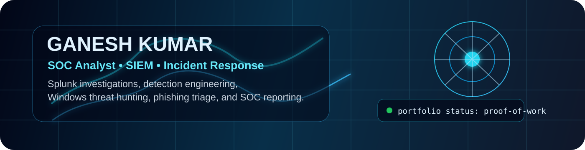
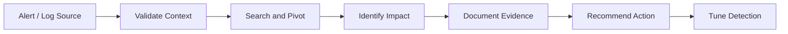

  

# Ganesh Kumar

**SOC Analyst / Cybersecurity Analyst Portfolio**  
Focused on **Splunk**, **SIEM monitoring**, **log analysis**, **incident response**, **detection engineering**, and hands-on blue-team labs.

I build practical security projects that show how I think during an investigation: collect logs, ask the right questions, write searches, document evidence, tune detections, and explain risk clearly.

  
  
  

---

## Hiring Manager Quick Scan

| What I Can Do | Proof In My GitHub |
| --- | --- |
| Investigate web logs in Splunk | Apache log analysis lab with SPL hunts, detections, evidence register, and final SOC report |
| Write analyst-ready detections | Detection catalog with severity, data source, triage, tuning, and Python validation |
| Hunt Windows events | Windows failed logon, PowerShell, and local admin event hunting examples |
| Triage phishing reports | Phishing workflow, IOC register, report template, and ticket note structure |
| Document incidents professionally | Network IR casebook with timeline, containment actions, and lessons learned |

---

## Featured SOC Portfolio

| Project | Why It Matters | Evidence |
| --- | --- | --- |
| [SOC Splunk Apache Log Analysis Lab](https://github.com/ganeshngl404/soc-splunk-apache-log-analysis-lab) | Shows SIEM investigation from Apache logs in an Ubuntu/VirtualBox lab | `SPL queries`, `SOC report`, `detections`, `sample logs`, `playbook` |
| [SIEM Detection Engineering Lab](https://github.com/ganeshngl404/siem-detection-engineering-lab) | Shows how suspicious behavior becomes alert logic and tuning guidance | `detection catalog`, `triage runbook`, `validator script` |
| [Windows Event Threat Hunting Lab](https://github.com/ganeshngl404/windows-event-threat-hunting-lab) | Shows endpoint hunting for logons, PowerShell, and admin changes | `hunt queries`, `sample events`, `threat hunt report` |
| [Phishing Email Triage Playbook](https://github.com/ganeshngl404/phishing-email-triage-playbook) | Shows structured email investigation and SOC ticket writing | `triage workflow`, `IOC register`, `case report`, `ticket template` |
| [Network Incident Response Casebook](https://github.com/ganeshngl404/network-incident-response-casebook) | Shows network alert triage and incident response documentation | `case timeline`, `IR playbook`, `report template`, `detection ideas` |
| [CYBER-SECURITY-TASKS](https://github.com/ganeshngl404/CYBER-SECURITY-TASKS) | Shows early hands-on security practice and reconnaissance learning | `Nmap task`, `network discovery notes` |

---

## My SOC Investigation Workflow

I care about the full analyst loop: not just finding something suspicious, but proving what happened, explaining why it matters, and writing the next action clearly.

---

## Technical Focus

**SIEM & Logs**
- Splunk SPL searches, dashboards, alert logic, Apache access logs, Windows Security events

**SOC Analysis**
- Alert triage, evidence handling, incident timelines, escalation notes, false-positive tuning

**Threat Hunting**
- Failed login patterns, suspicious PowerShell, web path probing, DNS beacon behavior, phishing indicators

**Systems & Tools**
- Ubuntu, Apache, VirtualBox, Windows Event Logs, Nmap, GitHub, Python, Markdown documentation

---

## Evidence Standard

I keep this profile honest and recruiter-safe:

- Public repositories use **sanitized or synthetic samples** when raw lab data may expose private system details.
- Reports and playbooks show **real analyst process**, not exaggerated claims.
- Private screenshots can be added after removing IPs, usernames, hostnames, tokens, and credentials.
- Every project is structured so an interviewer can ask: “Walk me through what you did,” and I can explain the workflow.

See the detailed portfolio map: [Evidence Map](./docs/evidence-map.md)

## What I Am Improving Next

I am actively adding sanitized screenshots, walkthrough notes, and small validation scripts. I will not backdate commits or publish fake proof. The goal is a portfolio that feels strong because it is explainable, safe, and real.

---

## Interview Talking Points

- How Apache logs move into Splunk and become searchable events.
- How to separate scanning noise from real risk.
- How to write a triage note that another analyst can understand.
- How detection thresholds can create false positives and how to tune them.
- How to preserve evidence without exposing sensitive data.

---

## Current Goal

I am building a professional blue-team portfolio for **SOC Analyst**, **Cybersecurity Analyst**, and **Junior Security Operations** roles. My focus is practical investigation ability, clean reporting, and steady growth through hands-on labs.

## Contact

- GitHub: [ganeshngl404](https://github.com/ganeshngl404)
- LinkedIn: [Ganesh Kumar S](https://www.linkedin.com/in/ganesh-kumar-s-a6315a296)
